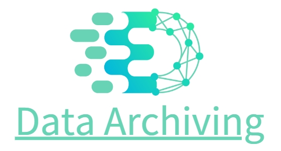

# <center> Data Archiving </center>  

 
  



## 简介

本项目/工具解决的痛点：解决了因数据库表的数据量太大而导致的数据库性能下降的问题。


> 对“数据库大表”进行归档/月切/数据迁移效果：  


## 技术点
- 定时任务
- 事务
- 重试机制
- 邮件告警
- 分布式锁
- SQL定制化


## 安装与使用

### 环境:
- JDK 17
- MySQL 8.0
- Redis 5.0
- Maven 3.X


### 步骤:

1. 克隆项目到本地
```bash 
git clone https://gitee.com/thebackendroachcyrong/data-archiving.git
```
2. 准备好环境和依赖
3. 修改yml配置文件
4. 基于MP创建归档表的pojo实体类（参考demo中的OrderInfo）
5. 补充PublicXX类/接口的逻辑（带有TODO的地方）
6. 运行项目
7. 调用API接口进行归档


### 请求方式:

> 详情见/others文件夹下的md文档。

- 方式1：【默认】根据当前输入的日期月份进行数据归档（这样更灵活，随时可以归档），默认切走当月的前第3个月的数据。
- 方式2：由定时任务触发的归档日期进行数据归档，无参数，默认切走当月的前第2个月的数据。


## 适用场景
1. 对本项目进行适当调整或者“二次开发”，来针对特定的数据库/表进行归档。
2. 适用于单体架构系统或单体架构集群部署或分布式系统的场景，可以把项目集成到系统中，定时执行归档任务，
也可以通过API接口调用。如果系统有“峰值流量”，建议在低峰期迁移数据。
比如凌晨流量小的时候进行数据归档/月切/数据迁移，避免迁移过程中占用过多资源，影响到系统的正常运行业务。

> 注：自定义归档逻辑时推荐采用JDBC来做持久层，可以参考我提供的示例。  
> JDBC的优势:  
> 1）性能好：相比ORM框架，少了对象转换时的消耗，在大数据量的场景下JDBC的性能要优于ORM框架。  
> 2）灵活性高：可以灵活地编写SQL语句，支持复杂的查询，灵活地处理结果集。  
> 3）可控性强：可以控制事务的粒度，支持事务的回滚和提交。

## 贡献与合作：
> 如有合作意向，请联系作者。  
> 邮箱: roachcode1024@163.com  
> 飞书账号:  

